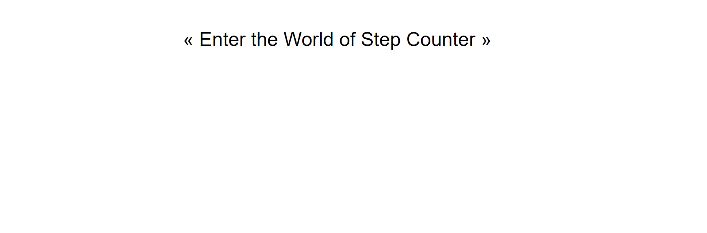
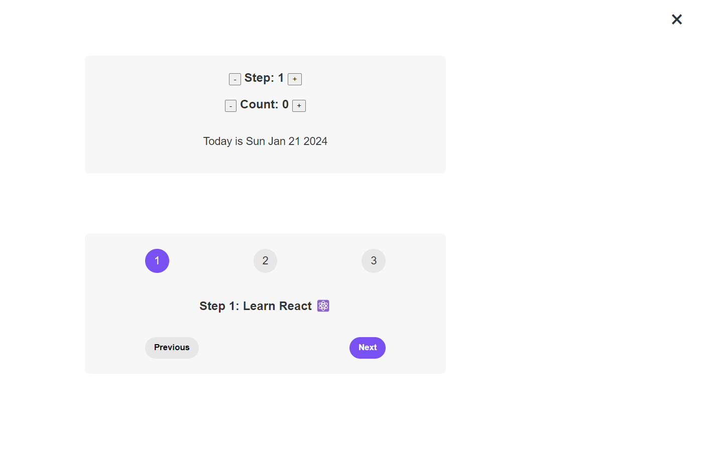

# Simple Step Counter React Project (State Management in React )

This project is a simple and easy demonstration of State Management in React.

I developed this project as part of my learning. And in this project I have not only used the State feature of react but also have demonstrated how we can play with it.

## Kindly find below points for learning

- Sate is like a `memory` of React. And react maintains the state and `save` the `value` of state.
- State should be set or updated using a `callback function`.
- Each Component has and manages its own state, no matter how many times we render the component.
- When we update the state the complete comonent is `re-rendered`.
- Entire UI is representation of current state of all components.
- A React application is all about changing states all time and rendering correct state everytime.
- With State we view UI as a reflection of data changing over time.

## Practical guidlines which we should follow regardubg states.

- Use a state variable for anydata that the component should keep track of("remember") over time. This is data that will change at some point. In Vanilla JS, that's a let variable, or an [] or {}.
- Whenver you want something to be dynamic, create a piece of state related to that `thing`, and update the state when `thing` needs to be updated.
- If you want to change the way a component looks, or data it displays, update its `state`. This usually happens in an `event handler` function.
- For data that should not trigger component re-renders, `Don't use State`. Use a regular variable instead. It's a most common beginner mistake.

## How to run this project

- Download or clone the repository
- Do a `npm install` to install necessary packages
- Then run `npm run start`
- Then the project should locally at port 3000.

## After Running it should look like below:

Click on "<< Enter the world of Step counter >>". Then you will see below window.

Feel Free to play around 😀
